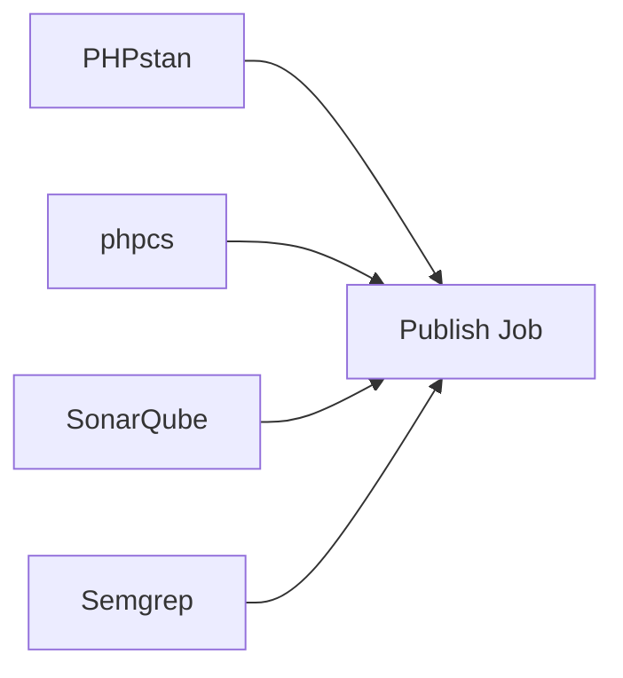

# Audit API (Backend) - under server part

Spring Boot backend application written in **Kotlin**, responsible for:

- Parsing audit issues from a **CSV file**
- Loading additional **analysis/statistics JSON**
- Exposing a REST API endpoint returning a combined **audit report**
- Running locally or inside **Docker**

---

## Tech Stack

- **Kotlin**
- **Spring Boot 3**
- **Java 17**
- **Gradle (Kotlin DSL)**
- **Docker**
- Embedded **Tomcat**

---

## API Overview

### Get Audit Report

Returns detailed CSV with issues together with aggregations from multiple reporting tools

**Endpoint**
GET /details?{project_key}

**Response Example**
```json
{
  "healthScore": {
    "score": 96,
    "grade": "A",
    "trend": 0,
    "previousScore": 96
  },
  "kpis": [
    {
      "id": "open_issues",
      "label": "Open Issues",
      "value": 2,
      "trend": 0,
      "isTrendPositive": true,
      "sparklineData": []
    },
    {
      "id": "coverage",
      "label": "Coverage",
      "value": 0.0,
      "trend": 0,
      "isTrendPositive": false,
      "sparklineData": []
    }
  ],
  "sonarQubeData": {
    "healthStatus": "critical",
    "bugs": 1,
    "vulnerabilities": 1,
    "codeSmells": 1,
    "coverage": 0.0,
    "technicalDebt": 0,
    "duplications": 0.0,
    "qualityGate": "Failed",
    "reliability": "B",
    "security": "B",
    "maintainability": "B",
    "severityBreakdown": {
      "blocker": 1,
      "critical": 1,
      "major": 1,
      "minor": 1,
      "info": 1
    },
    "lastRun": "2026-02-16T12:52:55.777092400Z"
  },
  "semgrepData": null,
  "phpcsData": null,
  "phpstanData": null,
  "trendData": [],
  "topIssues": [
    {
      "id": "765495b6-ddf6-4e04-8271-65dbbe041c89",
      "severity": "Medium",
      "tool": "SonarQube",
      "ruleId": "php:S125",
      "description": "Remove this commented out code.",
      "filePath": "app/Models/User.php",
      "firstDetected": "2024-11-05T13:16:32+0000"
    },
    {
      "id": "9afda9a3-68ff-4e6f-ad5f-cff9b42163a1",
      "severity": "Low",
      "tool": "SonarQube",
      "ruleId": "php:S1185",
      "description": "Remove this method \"version\" to simply inherit it.",
      "filePath": "app/Http/Middleware/HandleInertiaRequests.php",
      "firstDetected": "2024-11-05T13:16:32+0000"
    }
  ],
  "repositoryHealth": [],
  "projectSummary": {
    "id": "age_verification",
    "name": "age_verification",
    "description": "",
    "repositoryCount": 1,
    "healthScore": 96,
    "healthStatus": "healthy",
    "grade": "A",
    "totalIssues": 2,
    "criticalIssues": 0,
    "coverage": 0.0,
    "lastScan": "698f2708b640967503c761e7",
    "trend": 0,
    "tools": [
      "SonarQube"
    ]
  }
}
```

### Running locally

1) value for SONAR_TOKEN has to be added as environmental variable
3) composing Mongo DB through docker-compose.yml in root of the server project
2) ./gradlew bootRun

**Application will be available at**
http://localhost:8080/details

### Architecture



### TODOs:

- unify docker compose yaml files
- clarify mongo db runtime - do not expose port publically
- Cleanup server to not require sonar and server API definitions in config 
- API specifikace

#### TODO Apis:

- Overwiew API for dashboard
- Individual repo view

```openapi
# List of all projects
GET /projects?filter={filter}&page={page}&size={size}

# Overview of all projects
GET /projects/overview?filter={filter}

# Detail of single project
GET /projects/:project_key

# Overview of single project
GET /projects/:project_key/overview?filter={filter}

# List of all repositories under project
GET /projects/:project_key/repositories?filter={filter}&page={page}&size={size}

# Overview of single repository
GET /projects/:project_key/repositories/:repo_key


### Analysis API

PUT /projects/:project_key/repositories/:repo_key/analysis/sonarqube?tool-name={name}
PUT /projects/:project_key/repositories/:repo_key/analysis/phpstan?tool-name={name}
PUT /projects/:project_key/repositories/:repo_key/analysis/phpcs?tool-name={name}
PUT /projects/:project_key/repositories/:repo_key/analysis/junit?tool-name={name}

```
